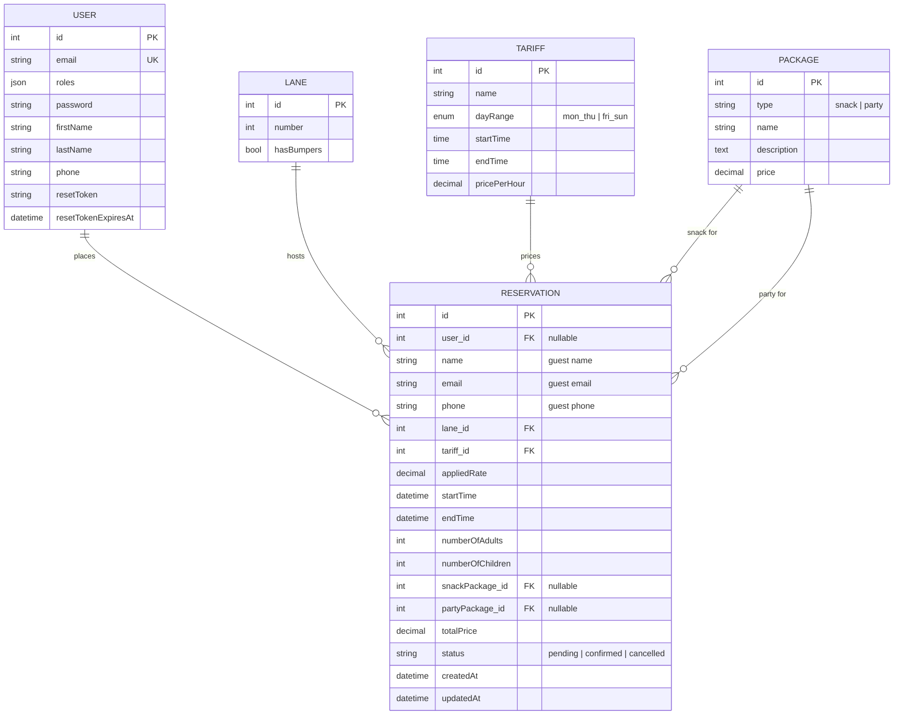

```mermaid
erDiagram
    USER ||--o{ RESERVATION : places
    USER {
        int id PK
        string email UK
        json roles
        string password
        string firstName
        string lastName
        string phone
        string resetToken
        datetime resetTokenExpiresAt
    }

    LANE ||--o{ RESERVATION : hosts
    LANE {
        int id PK
        int number
        bool hasBumpers
    }

    TARIFF ||--o{ RESERVATION : prices
    TARIFF {
        int id PK
        string name
        enum dayRange "mon_thu | fri_sun"
        time startTime
        time endTime
        decimal pricePerHour
    }

    PACKAGE ||--o{ RESERVATION : "snack for"
    PACKAGE ||--o{ RESERVATION : "party for"
    PACKAGE {
        int id PK
        string type "snack | party"
        string name
        text description
        decimal price
    }

    RESERVATION {
        int id PK
        int user_id FK "nullable"
        string name "guest name"
        string email "guest email"
        string phone "guest phone"
        int lane_id FK
        int tariff_id FK
        decimal appliedRate
        datetime startTime
        datetime endTime
        int numberOfAdults
        int numberOfChildren
        int snackPackage_id FK "nullable"
        int partyPackage_id FK "nullable"
        decimal totalPrice
        string status "pending | confirmed | cancelled"
        datetime createdAt
        datetime updatedAt
    }
```
